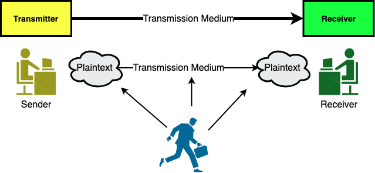
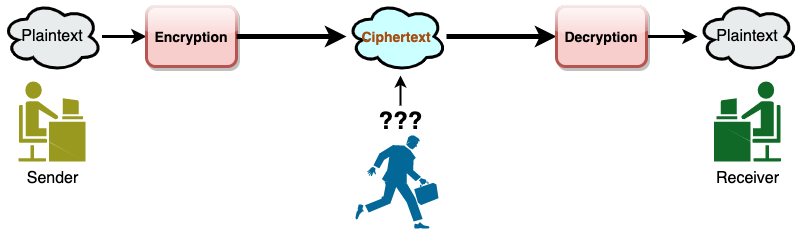
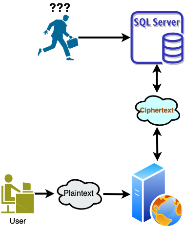

# Encryption and Decryption

When we send a message over a network (any type of format), it is possible that can be captured by third party.  

Encryption is the process of converting normal message (plaintext) into meaningless message (Ciphertext). Whereas Decryption is the process of converting meaningless message (Ciphertext) into its original form (Plaintext). ... While decryption is the process of converting meaningless message into its original form.



<center>Figure 1. Communication without Encryption/Decryption</center>


Also




<center>Figure 2. Communication with Encryption/Decryption</center>


Also




<center>Figure 3. Encryption/Decryption usage example </center>

# Part I - Simple Example

This section we will use all lower case characters  and numbers as the alphabet. 


```python
plaintext='hello there agent 007.' # our plaintext
alphabet=list('abcedfghijklmnopqrstuvwxyz .,0123456789') # original characters to use

# we want to shuffle the alphabet to create our secret code
# we use a function for that. 

def mixed(x):
    import random
    a = x[:]
    random.shuffle(a)
    return a

shuffled=mixed(alphabet)

# now we have the alphabet and shuffled version
# we can create our Encryption and Decryption dictionary blocks

encr_level1 = dict(zip(alphabet, shuffled))
decr_level1 = dict(zip(shuffled, alphabet))

# plese print and analyze them (just remove # below)

#print(encr_level1)
#print(decr_level1)

```


```python
# Now we can write our Encryption block as a function

def encrp1(mes):
    t=[]
    kk=list(mes)
    for i in kk:
        t.append(encr_level1[i])
    emes=''.join(t)
    return emes
```


```python
# Encrypt the plaintext

plaintext='hello there agent 007.'  # original message
ciphertext=encrp1(plaintext) # Encrypted message
print(ciphertext)
```

    jbeecnajbwbnogbzanii5d


```python
# Now we can write our Decryption block as a function

def decrp1(emes):
    t=[]
    kk=list(emes)
    for i in kk:
        t.append(decr_level1[i])
    dmes=''.join(t)
    return dmes
```


```python
# Decrypt the ciphertext to receive our plaintext

original_message=decrp1(ciphertext)
print(original_message)
```

    hello there agent 007.


# Part II - All possible characters in a keyboard

This section we will use all possible characters as our alphabet. This could be done easly using Python's ```string``` module. 


```python
#encr_level1
import string

alphabet=list(string.printable) # this will get all possible characters

#print(alphabet)

shuffled=mixed(alphabet) # shuffles the alphabet 

# we can create our new Encryption and Decryption dictionary blocks

encr_level1 = dict(zip(alphabet, shuffled))
decr_level1 = dict(zip(shuffled, alphabet))

# using the same functions above we can encrypt more complecated messages
message='Hello agent 007. The next mission: Level 3 activated #0$%# deliver'

ciphertext=encrp1(message) # Encrypted message
print(ciphertext)

original_message=decrp1(ciphertext)
print(original_message)

```

    WO||c;Y!OiS;DD>l;ypO;iO^S;N6rr6ci@;vO}O|;m;YaS6}YSOL;/D+"/;LO|6}Oj
    Hello agent 007. The next mission: Level 3 activated #0$%# deliver


# Part III - More than one character to create ciphertext

At this moment when we encrypt ```Hello``` for example we got our ciphertext as ```3azzm```. Whenever we use ```encr_level1``` to encode ```Hello``` we will get same  ciphertext```3azzm```. Also ```l``` will be always ```z``` and that makes it easy to crack this code. Now we will use three different characters to represent letters in the ```plaintext```.  

For example, let's assume we have our alphabet ```['A','B','C']``` and we want to encode ```A``` as either ```S``` or ```M```, ```B``` as either ```R``` or ```T```, and ```C``` as either ```J``` or ```O```. 


```python
alphabet=['A','B','C']
shuffled=[['S','M'],['R','T'],['J','O']]
EE = dict(zip(alphabet,shuffled)) # Encryption dictionary
DD1=dict(zip([row[0] for row in shuffled], alphabet)) # Decryption dictionary I
DD2=dict(zip([row[1] for row in shuffled], alphabet)) # Decryption dictionary II
print(EE)
print(DD1)
print(DD2)
```

    {'A': ['S', 'M'], 'B': ['R', 'T'], 'C': ['J', 'O']}
    {'S': 'A', 'R': 'B', 'J': 'C'}
    {'M': 'A', 'T': 'B', 'O': 'C'}


```python
# Now using this idea we will create three different shuffled and Decryption dictionary
import random
import string

def mixed(x):
    import random
    a = x[:]
    random.shuffle(a)
    return a

alphabet=list(string.printable) # this will get all possible characters

shuffled=mixed(alphabet) # shuffle alphabet 
res = random.sample(range(227, 350),len(alphabet)) 
res1 = random.sample(range(351, 458),len(alphabet))

B=[[i,chr(j),chr(r)] for i,j,r in zip(shuffled,res,res1)]
#print(B)
EE = dict(zip(alphabet,B))
DD1=dict(zip([row[0] for row in B], alphabet))
DD2=dict(zip([row[1] for row in B], alphabet))
DD3=dict(zip([row[2] for row in B], alphabet))

def encrp2(emes):
    t=[]
    kk=list(emes)
    for i in kk:
        t.append(random.choice(random.choice(list(EE[i]))))
    emes=''.join(t)
    return emes

def decrp2(mes):
    t=[]
    kk=list(mes)
    for i in kk:
        if i in DD1.keys():
            t.append(DD1[i])
        elif i in DD2.keys():
            t.append(DD2[i])
        else:
            t.append(DD3[i])
    dmes=''.join(t)
    return dmes
```


```python
message='Hello agent 007. The next mission: Level 3 activated #0$%# deliver'

ciphertext=encrp2(message) # Encrypted message
print(ciphertext)

original_message=decrp2(ciphertext)
print(original_message)
```

    ÿ1ňdžñy\ŏǂpƪƁVVĥĆyêŸǂyæ1Ŝ+y[Ʈ..ŕñƜƖyşǂĤǂdžƁ7ŌóĠĀQ^\Ā1ăŌ)ĉƅòƟyăǂvŕĤ÷	
    Hello agent 007. The next mission: Level 3 activated #0$%# deliver


###############

Example above ```Hello``` is encoded as ```P1ňdžƦ```. If we run the aove cell we will get different ciphertext. ```Hello``` is now ```ƽ÷džňM``` and again ```ÿ1ňdžñ```. Also you can see that letter ```l``` is different for all cases obove. 

# Part IV - Using a file  

Assume that you want to send a text file and want to make sure that is Encrypted. This could be also a username/password file, etc. Our file name is ```test.txt```. 


```python
f = open("test.txt", "r")
message=f.read()
f.close()
print(message)
```

    This is time to write down a list of activities you and your family want to do this summer. 
    This is an exercise that will free you from the limits of your four walls. 
    Number your list from one to however far you get and maybe even write it 
    down on actual paper.
    This is not a homework assignment. Get the first few ideas out. Now keep going, 
    because that's when the ideas get ridiculous and really fun.
    Want to walk on the moon? Write it down. Want to play Quidditch with J.K. Rowling? 


```python
ciphertext=encrp2(message) # Encrypted message
print(ciphertext)
```

    i5Q.yQŋƁ+Ʈķ÷ŌƪƦƁćƗƮĀ1ŌŨñćpŌóydžƮŋĀyñžƁƷ;ƪƮĤƮƪŕ1ŋŌFMƒƁ\æ!yŷñƒěƁsƷƛŕdžĜƁ0ópĀŌ+ƦƁ!ñƁƪŸŕŋŌ.ƒ[ķǂ	ŰŌƳêŸƮƚyƮƚyóƜŌ÷ƀǂ	ĠŕƚǂƁƪ5óƪƁƨŕvňƁžě1ǂƁŷMƒƁžěƦ[ƁƪŸ1ƁvQķƮƪŋyƦsŌŷMƒěƁsƦøƗƁćódžňƚ6Ɓhn/ƛĢ÷ěŌFM/	ŌdžQ.+ŌûƗƦķyƦæ1ŌĀMƁ5Ʀ0÷ůǂƗŌsƷ	ƁFñƒƁBǂƪƁóæŨyƛóĜĢ÷y÷Ĥ÷ƜyƨěQĀǂƁQĀŌîŨñ0pyƦæyƷƍĀøƷvŌīóī÷	ŰƳi5ŕ.Ōŕ.ypMĀŌóŌ5Ʀ[÷0ñƗƐy\ŋ.ƮBæƛǂp+6Ɓǁ1ƪŌ+Ÿ1yžŕěƚ+ys÷ƨyQă÷\ŋƁñƒƪĆƁŪñćŌƐ1÷qƁƺMQpBƈyîƿ÷Ġóƒƚ1Ōƪ5ƷĀïŋƁƨŀ1ƜŌƪŀǂŌŕ!ǂóƚyŏ÷ƪyěŕ!ŕƍ/vMƒŋy\æăŌě÷\vdžFŌs/Ɯ6hżópƪƁƪñƁƨƷňƐŌMæŌƪŸ1ŌķñƦpĝyņěƮ+÷ƁƮ+yăMƨƜĆŌEóæĀyĀñŌŶvóĜŌŗƒŕŨăƮĀĠŀŌćŕƪŀƁè6ƧŰŌ=ñ0ňQpŏƁ


```python
with open('Text_enc.txt','w') as outF:    
    outF.write(ciphertext)
```


```python

```


```python
f = open("Text_enc.txt", "r")
message=f.read()
f.close()
print(message)
```

    i5Q.yQŋƁ+Ʈķ÷ŌƪƦƁćƗƮĀ1ŌŨñćpŌóydžƮŋĀyñžƁƷ;ƪƮĤƮƪŕ1ŋŌFMƒƁ\æ!yŷñƒěƁsƷƛŕdžĜƁ0ópĀŌ+ƦƁ!ñƁƪŸŕŋŌ.ƒ[ķǂ	ŰŌƳêŸƮƚyƮƚyóƜŌ÷ƀǂ	ĠŕƚǂƁƪ5óƪƁƨŕvňƁžě1ǂƁŷMƒƁžěƦ[ƁƪŸ1ƁvQķƮƪŋyƦsŌŷMƒěƁsƦøƗƁćódžňƚ6Ɓhn/ƛĢ÷ěŌFM/	ŌdžQ.+ŌûƗƦķyƦæ1ŌĀMƁ5Ʀ0÷ůǂƗŌsƷ	ƁFñƒƁBǂƪƁóæŨyƛóĜĢ÷y÷Ĥ÷ƜyƨěQĀǂƁQĀŌîŨñ0pyƦæyƷƍĀøƷvŌīóī÷	ŰƳi5ŕ.Ōŕ.ypMĀŌóŌ5Ʀ[÷0ñƗƐy\ŋ.ƮBæƛǂp+6Ɓǁ1ƪŌ+Ÿ1yžŕěƚ+ys÷ƨyQă÷\ŋƁñƒƪĆƁŪñćŌƐ1÷qƁƺMQpBƈyîƿ÷Ġóƒƚ1Ōƪ5ƷĀïŋƁƨŀ1ƜŌƪŀǂŌŕ!ǂóƚyŏ÷ƪyěŕ!ŕƍ/vMƒŋy\æăŌě÷\vdžFŌs/Ɯ6hżópƪƁƪñƁƨƷňƐŌMæŌƪŸ1ŌķñƦpĝyņěƮ+÷ƁƮ+yăMƨƜĆŌEóæĀyĀñŌŶvóĜŌŗƒŕŨăƮĀĠŀŌćŕƪŀƁè6ƧŰŌ=ñ0ňQpŏƁ


```python
original_message=decrp2(ciphertext)
print(original_message)
```

    This is time to write down a list of activities you and your family want to do this summer. 
    This is an exercise that will free you from the limits of your four walls. 
    Number your list from one to however far you get and maybe even write it 
    down on actual paper.
    This is not a homework assignment. Get the first few ideas out. Now keep going, 
    because that's when the ideas get ridiculous and really fun.
    Want to walk on the moon? Write it down. Want to play Quidditch with J.K. Rowling? 

